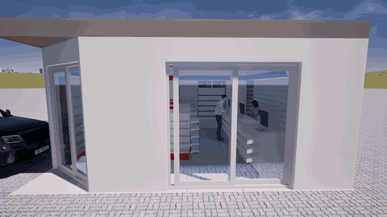

# Henrique Sembla

**Applied AI · Process Automation · Data Analysis**

Computer Science professional focused on using technology to improve real workflows, communication and decision-making.

[LinkedIn](https://www.linkedin.com/in/henriquessembla) · [Email](mailto:henriquesembla@gmail.com) · [GitHub](https://github.com/Sembla)

---

## About me

I work at the intersection of **processes, engineering and technology**. My experience includes engineering project development, product and environment visualization, IT infrastructure, data analysis and the practical adoption of generative AI.

My current focus is not AI as a standalone trend. I am interested in where it produces useful outcomes: making technical information easier to understand, reducing repetitive work, improving presentations and supporting better decisions.

## Professional focus

| Applied AI | Process Automation | Data & Visualization |
|---|---|---|
| Generative image and video workflows | Python-based file and content workflows | SQL and data analysis |
| Prompt design and output review | API and system integration | Power BI and KPI development |
| Responsible use of AI-generated content | Process standardization | Decision-support presentations |

## Featured work

### [AI-assisted product creatives — SBL TECH](case-studies/sbl-tech-ai-creatives/README.md)

| FIFINE vertical creative | XZONE horizontal creative |
|---|---|
|  |  |

Two short product creatives developed with AI-assisted video workflows, human review and channel-specific editing. Reported campaign results were **more than 10,000 people reached per video in approximately two days**, plus **more than 2,000 store-directed actions**. The case explicitly separates reach and traffic from verified sales attribution.

**Evidence:** [case documentation](case-studies/sbl-tech-ai-creatives/README.md) · [media manifest](case-studies/sbl-tech-ai-creatives/media-manifest.json) · [FIFINE video](case-studies/sbl-tech-ai-creatives/assets/fifine-ai-creative.mp4) · [XZONE video](case-studies/sbl-tech-ai-creatives/assets/xzone-ai-creative.mp4)

### [AI-assisted project presentation — case study](case-studies/ai-commercial-presentation/README.md)

An anonymized proof of concept showing how a sanitized layout can be transformed into a conceptual visualization and an AI-generated virtual tour.

The case documents:

- The business communication problem and proposed workflow.
- The distinction between conceptual AI output and technical documentation.
- Known generative-AI distortions and review requirements.
- A reproducible Python pipeline for packaging the portfolio media.

**Evidence:** [case documentation](case-studies/ai-commercial-presentation/README.md) · [technical pipeline](case-studies/ai-commercial-presentation/pipeline/README.md) · [source code](case-studies/ai-commercial-presentation/pipeline/media_pipeline.py)

### [Real-time retail tour with Twinmotion](case-studies/twinmotion-retail-tour/README.md)

A fictional pharmacy environment transformed into a controlled 3D walkthrough with Twinmotion. The public case uses an AI-assisted conceptual redraw instead of the technical source layout and clearly distinguishes real-time 3D visualization from generative video.

**Evidence:** [case documentation](case-studies/twinmotion-retail-tour/README.md) · [sanitized layout](case-studies/twinmotion-retail-tour/assets/layout-conceitual-sanitizado.png) · [optimized tour](case-studies/twinmotion-retail-tour/assets/tour-twinmotion.mp4) · [media manifest](case-studies/twinmotion-retail-tour/media-manifest.json)

### [Engineering BOM Intelligence](https://github.com/Sembla/Engineering-BOM-Intelligence)

A tested engineering-data workflow inspired by a CAD-to-BOM process. Its public implementation uses a neutral schema, fictional identifiers and deterministic quality indicators without exposing organization-specific field names or component vocabulary.

**Evidence:** neutral CAD-style adapter · fictional public sample · deterministic quality flags · normalized CSV export · 12 automated tests

### [AI ERP Assistant](https://github.com/Sembla/ai-erp-assistant)

An executable Node.js prototype for querying fictional ERP-like operational data in Portuguese. It combines deterministic analytics, a dependency-free HTTP API, a responsive interface and an optional aggregate-only LLM explanation mode.

**Evidence:** working API and browser interface · local fallback · synthetic operational data · aggregate-only LLM boundary · 12 automated tests

### [Data Insight AI](https://github.com/Sembla/Data-insight-ai)

A sales-analysis prototype with local KPI answers and an optional LLM mode designed around a clear privacy boundary: only aggregates are sent to the external model.

**Evidence:** separated analytics core · local fallback · aggregate-only LLM context · 8 automated tests

### [GenAI Risk Analyst Pro](https://github.com/Sembla/GenAI-Risk-Analyst-Pro)

An educational high-stakes architecture prototype where Python rules calculate the synthetic classification, TF-IDF retrieves fictional policy documents and the optional LLM can explain—but not change—the decision.

**Evidence:** deterministic decision layer · visible retrieval sources · explicit safety limitations · 9 automated tests

## Technical toolkit

| Area | Tools and experience |
|---|---|
| Applied AI | Generative AI, prompt engineering, AI image/video workflows, output validation |
| Programming & automation | Python, JavaScript, TypeScript, Node.js, REST APIs, Git and GitHub |
| Data | SQL, Power BI, data analysis and KPI development |
| Engineering & visualization | AutoCAD, TopSolid Wood, Twinmotion, real-time 3D visualization and BOM-related workflows |
| Infrastructure & governance | Windows Server, Active Directory, cloud fundamentals, cybersecurity and ISO 27001 concepts |

## Project maturity

These repositories are portfolio prototypes, not production systems. Each featured project states its limitations and uses synthetic, fictional or anonymized inputs. The featured software projects also document their architecture and include automated tests. The original [GenAI Risk Analyst](https://github.com/Sembla/genai-risk-analyst) and [Data Insight AI Revision 1](https://github.com/Sembla/Data-insight-ai-REV1) are retained only as transparent superseded versions.

## Education

- Bachelor's degree in Computer Science.
- Postgraduate studies in Artificial Intelligence and Data Science.
- MBA studies in Cybersecurity and Project Management.
- Postgraduate studies in Systems Analysis and Development.

## Currently building

- Reproducible examples of AI applied to process improvement.
- Automation projects with clear inputs, outputs, tests and documentation.
- Data and BI projects connected to operational decisions.
- Creative-production experiments with measurable campaign indicators and explicit attribution limits.

---

Open to opportunities and collaborations involving **Applied AI, Automation, Data and Process Improvement**.

[Connect on LinkedIn](https://www.linkedin.com/in/henriquessembla) · [Send an email](mailto:henriquesembla@gmail.com)

