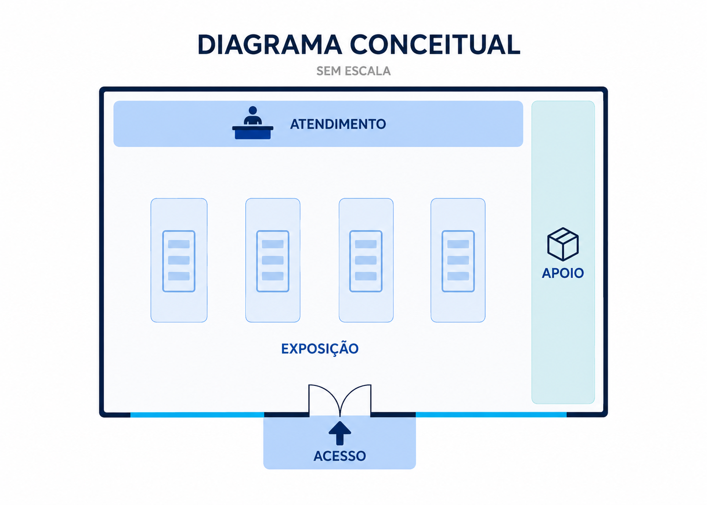
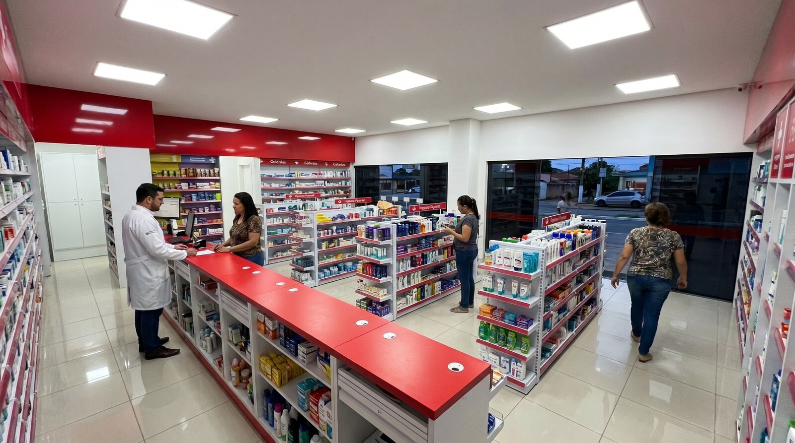
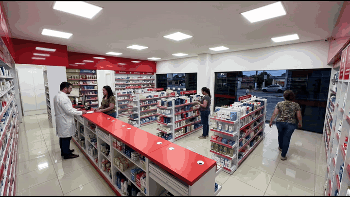

# IA aplicada à apresentação comercial de projetos

Prova de conceito sobre o uso de inteligência artificial para transformar um layout sanitizado de varejo farmacêutico em uma apresentação visual mais clara e imersiva.

> **Nota de transparência:** este é um experimento visual criado para avaliar aplicações de IA. O material não reproduz o projeto técnico real e não contém nomes, localização, valores, medidas, códigos ou dados identificáveis.

## Visão geral

Plantas e especificações técnicas são essenciais para execução, mas nem sempre comunicam com clareza como o ambiente será percebido depois de pronto. O objetivo deste trabalho foi reduzir essa distância de compreensão por meio de imagens conceituais e de um tour virtual gerados com IA.

O experimento permitiu avaliar como a IA pode facilitar a compreensão de um ambiente, criar uma narrativa visual e apoiar apresentações de projetos. Nenhum resultado comercial é atribuído diretamente a este material experimental.

## Desafio

Converter uma representação técnica em uma experiência visual compreensível, sem expor dados confidenciais e sem apresentar a simulação gerada por IA como documento de execução.

## Solução

Foi desenvolvida uma narrativa visual em três níveis:

1. **Layout conceitual sanitizado:** preserva apenas a lógica geral de circulação, atendimento, exposição e apoio.
2. **Visualização comercial gerada por IA:** apresenta uma hipótese visual do ambiente abastecido e em operação.
3. **Tour virtual gerado por IA:** cria uma experiência de navegação para apoiar a compreensão espacial do projeto.

## Demonstração

### 1. Layout conceitual sanitizado

Representação sem escala e sem informações técnicas de fabricação ou instalação. O arquivo foi redesenhado especificamente para apresentação de portfólio.

### 2. Visualização comercial gerada por IA

Imagem conceitual usada para demonstrar uma possível experiência do espaço finalizado. Não corresponde a um registro fotográfico nem substitui o projeto técnico.

### 3. Tour virtual gerado por IA

Clique na prévia para abrir o vídeo completo.

## Processo aplicado

| Etapa | Atividade | Valor para o projeto |
|---|---|---|
| Preparação | Seleção e anonimização das informações de entrada | Proteção de dados técnicos e comerciais |
| Direção visual | Definição do ambiente, composição, materiais e contexto de uso | Comunicação mais próxima da experiência esperada |
| Geração com IA | Criação da imagem e do tour virtual com apoio do NIM.Video | Apresentação mais imersiva e demonstrativa |
| Revisão | Identificação de distorções e separação entre conteúdo conceitual e técnico | Uso responsável da IA e redução de interpretações incorretas |
| Apresentação | Organização dos materiais em uma narrativa visual | Maior clareza para avaliação da proposta |

## Automação técnica reproduzível

Além da documentação visual, este repositório contém uma [automação em Python](pipeline/README.md) para preparar as mídias do case de maneira reproduzível.

O pipeline:

- Remove metadados incorporados em imagens e vídeos.
- Otimiza resolução, formato e tamanho dos arquivos.
- Converte o tour em um MP4 silencioso de 1280×720.
- Gera automaticamente o GIF de prévia.
- Produz um relatório JSON com propriedades e hashes dos arquivos.
- Possui testes unitários para as principais decisões de processamento e segurança.

**Limite de segurança:** o código não identifica informações confidenciais visíveis. A sanitização semântica do layout continua sendo uma etapa humana obrigatória antes do processamento.

**Código:** [`pipeline/media_pipeline.py`](pipeline/media_pipeline.py) · **Testes:** [`pipeline/tests/test_media_pipeline.py`](pipeline/tests/test_media_pipeline.py)

## Resultado do experimento

O teste demonstrou que uma planta sanitizada pode ser convertida em uma sequência visual composta por layout conceitual, imagem ambientada e tour virtual. A abordagem tem potencial para melhorar a clareza de apresentações e apoiar a discussão de propostas antes da execução.

Por se tratar de uma prova de conceito, este repositório não apresenta métricas de vendas, identidade de cliente ou resultados financeiros.

## Minha atuação

- Estruturação da proposta de uso de IA aplicada à melhoria do processo de apresentação.
- Preparação das referências e definição dos objetivos visuais.
- Criação e refinamento de prompts para imagem e vídeo.
- Geração da visualização comercial e do tour virtual.
- Revisão crítica dos resultados e identificação de distorções da IA.
- Organização do conteúdo para apresentação do projeto.
- Desenvolvimento do pipeline de preparação, validação e empacotamento das mídias.

## Competências demonstradas

- IA generativa aplicada a processos.
- Engenharia de prompts.
- Comunicação e narrativa visual.
- Transformação de informação técnica em conteúdo comercial.
- Geração e revisão de imagens e vídeos com IA.
- Gestão de confidencialidade e apresentação responsável de resultados.

## Limitações e transparência

- A imagem e o vídeo foram gerados por inteligência artificial.
- A IA alterou parcialmente proporções, mobiliários, produtos e características do ambiente.
- Os materiais são conceituais e não devem ser usados para fabricação, instalação, orçamento ou validação técnica.
- As decisões de execução permanecem baseadas exclusivamente nos documentos oficiais do projeto.
- Não são apresentados números de receita, identidade do cliente ou métricas sem comprovação.

---

**Finalidade:** demonstrar uma aplicação experimental de IA na melhoria da comunicação de projetos, com foco em clareza, experiência visual e apoio à apresentação de propostas.
