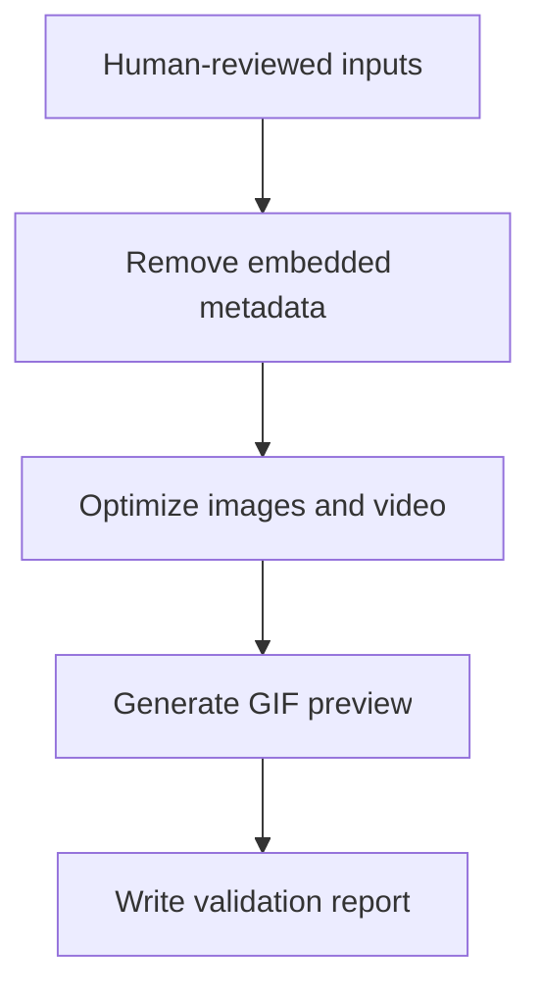

# AI Presentation Media Pipeline

A reproducible Python command-line workflow for preparing human-reviewed AI presentation media for a GitHub case study.

It converts three reviewed inputs into optimized portfolio assets and a validation report:



## What it does

- Removes embedded image and video metadata.
- Resizes the images for web presentation.
- Converts the video to a silent 1280×720 H.264 MP4.
- Generates a lightweight animated GIF preview.
- Records file sizes, SHA-256 hashes and media properties in JSON.
- Supports a dry-run mode and refuses to overwrite files unless explicitly requested.

## Security boundary

This pipeline **does not identify or redact confidential information visible inside an image**. Measurements, names, codes, logos, addresses and other sensitive visual content must be removed and reviewed by a person before execution.

Removing metadata is not the same as anonymizing visual content.

## Requirements

- Python 3.10 or newer.
- FFmpeg and FFprobe.
- ImageMagick (`magick` or `convert`).

No third-party Python package is required.

## Usage

From the case-study directory:

```bash
python pipeline/media_pipeline.py \
  --layout path/to/reviewed-layout.png \
  --visual path/to/ai-visual.jpg \
  --video path/to/ai-tour.mp4 \
  --output dist
```

Use `--dry-run` to inspect the external commands without executing them. Use `--overwrite` only when the existing output files should be replaced.

## Generated files

```text
dist/
├── layout-conceitual-sanitizado.png
├── visualizacao-comercial-ia.jpg
├── tour-virtual-ia.mp4
├── tour-preview.gif
└── processing-report.json
```

The report provides an auditable record of the generated artifacts without publishing absolute local paths or confidential project data.

See the [example validation report](example-processing-report.json) generated from the media published in this case.

## Tests

```bash
python -m unittest discover -s pipeline/tests -v
```

The unit tests verify the main safety and processing decisions, including metadata removal, silent-video generation, preview construction, output naming and overwrite protection.

## Design decisions

- **Human review remains mandatory:** semantic anonymization cannot be delegated safely to metadata tools.
- **No Python dependencies:** the orchestration layer uses the standard library while mature media tools perform encoding.
- **Deterministic output names:** the resulting folder can be referenced directly from a case-study README.
- **Verifiable artifacts:** hashes and media probes make the process reviewable and reproducible.
