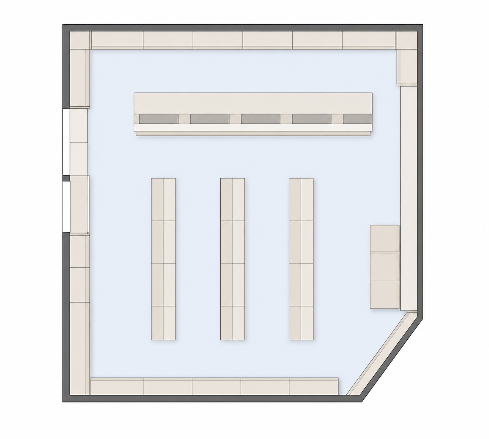

# Tour 3D de ambiente comercial com Twinmotion

Projeto fictício de visualização em tempo real desenvolvido para testar a transformação de um layout de farmácia em uma experiência espacial apresentada por vídeo.

> **Transparência:** o tour foi renderizado a partir de uma cena 3D criada no Twinmotion; ele não foi gerado por IA. A planta exibida neste case foi redesenhada e simplificada com apoio de IA exclusivamente para proteger o documento de origem.

## Visão geral

Plantas técnicas comunicam fabricação e instalação, mas exigem conhecimento especializado para interpretar a experiência do ambiente. Neste experimento, um layout fictício foi usado como referência para construir uma representação tridimensional e produzir um percurso de câmera pela loja.

O [Twinmotion](https://www.twinmotion.com/) é uma ferramenta de visualização em tempo real da Epic Games, baseada no Unreal Engine. O projeto explorou sua aplicação na comunicação de ambientes comerciais antes da execução.

## Demonstração

### Layout conceitual sanitizado

A imagem acima não é a planta técnica original. Foram removidos:

- Medidas, cotas e escalas.
- Códigos de peças, famílias e mobiliários.
- Fabricantes, materiais, cores e acabamentos.
- Especificações de ferragens, portas e fechamentos.
- Símbolos, chamadas e informações de execução.

O desenho conserva apenas uma interpretação genérica da organização espacial: perímetro, atendimento, ilhas centrais e circulação. Não deve ser usado para orçamento, fabricação, instalação ou validação dimensional.

### Tour renderizado no Twinmotion

Clique na prévia para abrir o vídeo completo. A cópia de portfólio foi reduzida para 1280×720, teve os metadados removidos e não possui áudio.

## Processo aplicado

| Etapa | Atividade | Resultado |
|---|---|---|
| Referência | Interpretação da organização espacial da planta fictícia | Definição do ambiente a representar |
| Construção 3D | Preparação da cena, mobiliários e elementos comerciais | Modelo tridimensional navegável |
| Ambientação | Aplicação de materiais, iluminação, objetos e personagens | Contexto visual de uso da loja |
| Percurso | Planejamento da câmera e sequência de navegação | Leitura progressiva do espaço |
| Renderização | Exportação do vídeo no Twinmotion | Tour demonstrativo em 1920×1080 na fonte original |
| Portfólio | Sanitização da planta e otimização da mídia | Publicação sem detalhes técnicos do documento original |

## O que o projeto demonstra

- Interpretação espacial de layouts comerciais.
- Visualização arquitetônica em tempo real.
- Construção e ambientação de cenas no Twinmotion.
- Planejamento de câmera e narrativa de percurso.
- Comunicação visual de ambientes antes da execução.
- Separação entre documentação técnica e material de apresentação.
- Tratamento responsável de informações de projeto em portfólio público.

## Limitações

- O ambiente é fictício e não representa uma loja ou cliente real.
- O tour é uma visualização conceitual e não comprova viabilidade de engenharia.
- A planta sanitizada pode alterar proporções e geometrias do documento privado.
- Materiais, mobiliários, produtos e personagens são elementos de ambientação.
- Não são divulgadas medidas, arquivos-fonte, custos ou especificações de fabricação.
- O projeto não é afiliado nem endossado pela Epic Games. Twinmotion e Unreal Engine são marcas de seus respectivos proprietários.

## Evidências técnicas

| Arquivo | Propriedade | SHA-256 |
|---|---|---|
| `layout-conceitual-sanitizado.png` | Ilustração conceitual sem texto ou dimensões | `a382161506aa43fcbaec94635f8c3cf185b9bd0d2884b9f2ab03ab452580841b` |
| `tour-twinmotion.mp4` | 10,40 s · 1280×720 · 30 FPS · sem áudio | `9dc987b125ca91ab6465db90d0e99148b38b899b22c18107e7a2f2eb605935d6` |

## Relação com o case de IA generativa

Este trabalho e o case de apresentação com IA demonstram abordagens diferentes:

| Twinmotion | IA generativa |
|---|---|
| Cena 3D construída e controlada | Imagem ou vídeo sintetizado por modelo generativo |
| Maior controle de câmera, objetos e geometria | Maior velocidade para exploração visual |
| Alterações feitas diretamente na cena | Alterações podem introduzir distorções imprevisíveis |
| Adequado para percursos reproduzíveis | Adequado para conceitos e hipóteses visuais |

---

**Finalidade:** demonstrar a aplicação de visualização 3D em tempo real à comunicação de um ambiente comercial fictício, sem publicar o documento técnico usado no experimento.
